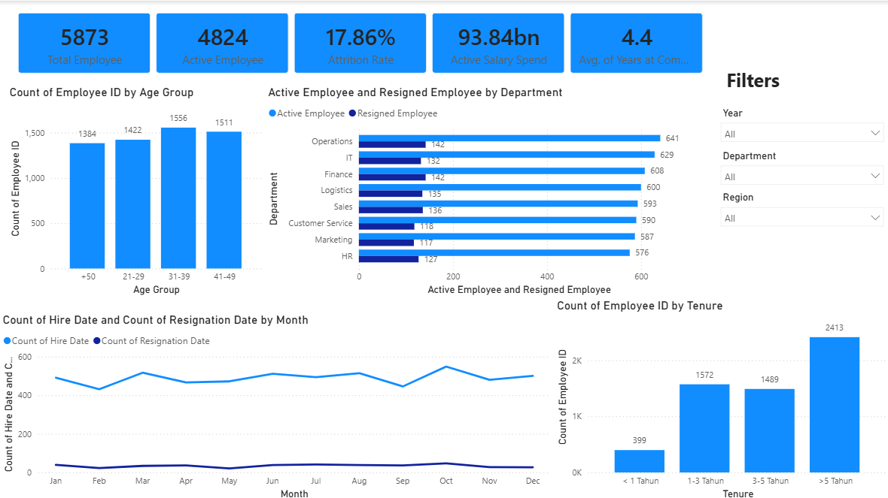

# HR-Analytic-Portofolio
## Overview
This project analyzes a synthetic HR dataset to understand workforce characteristics, employee performance, attendance, compensation, and attrition. The analysis was conducted using Python, SQL, Excel, and Power BI to generate business insights and interactive dashboards.

## Business Problem
The HR department requires insights into workforce characteristics, employee performance, compensation, attendance, and attrition to support data-driven strategic decision-making.

## Project Objective
- Analyze workforce demographics
- Analyze employee compensation
- Evaluate employee performance
- Analyze attendance patterns
- Identify employee attrition trends
- Build an interactive HR dashboard

## Dataset
- Rows : 5,920
- Columns : 18
- Source : Synthetic HR Dataset (dataset created for portfolio purposes)

## Tools
- Python
- Pandas
- Matplotlib
- Seaborn
- PostgreSQL
- Excel
- Power BI


## Project Workflow
1. Dataset
2. Data Cleaning
3. EDA
4. Statistical Analysis
5. Dashboard
6. Business Insights
7. Business Recommendations

## Data Cleaning
- Removed duplicate records
- Converted date columns to datetime
- Handled missing values
- Corrected inconsistent department names
- Validated future resignation dates
The dataset was cleaned to improve data quality before conducting statistical analysis and visualization.

## Exploratory Data Analysis
The exploratory analysis covers:
- Workforce Overview
- Employee Demographics
- Compensation Analysis
- Performance Analysis
- Attendance Analysis
- Job Satisfaction Analysis
- Attrition Analysis
- Correlation Analysis

## Statistical Analysis
- Mean
- Median
- Standard Deviation
- Outlier Detection (IQR)
- Correlation Analysis

## Skills Demonstrated
- Data Cleaning
- Exploratory Data Analysis (EDA)
- Descriptive Statistics
- Correlation Analysis
- Data Visualization
- SQL Query
- Dashboard Development
- Business Insight Generation

## Dashboard Preview


## Key Insights
- Operations has the largest workforce.
- Finance has the highest average monthly salary.
- Employee attrition rate is 17.86%.
- Employees with 1-3 years of tenure show the highest attrition rate.
- Most numerical variables exhibit very weak linear correlations.

## Business Recommendations
- Review retention strategies for employees with 1-3 years of tenure.
- Investigate factors contributing to higher attrition in the Finance department.
- Monitor employee satisfaction regularly to identify improvement opportunities.
- Consider further predictive analysis to identify factors influencing employee attrition.

```
HR-Analytics-Portfolio
│
├── Data
│   ├── hr_data_raw.csv
│   └── hr_data_cleaning.csv
│
├── Python
│   ├── Data Understanding.py
│   ├── Data Cleaning.py
│   └── EDA.py
│
├── SQL
│
├── Excel
│
├── Power BI
│
├── Images
│
├── Report.md
│
└── README.md
```