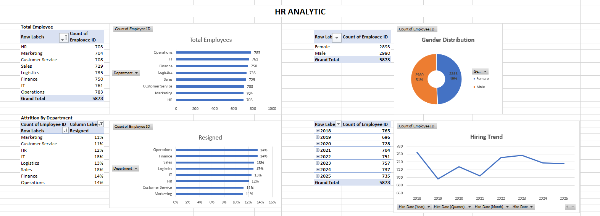
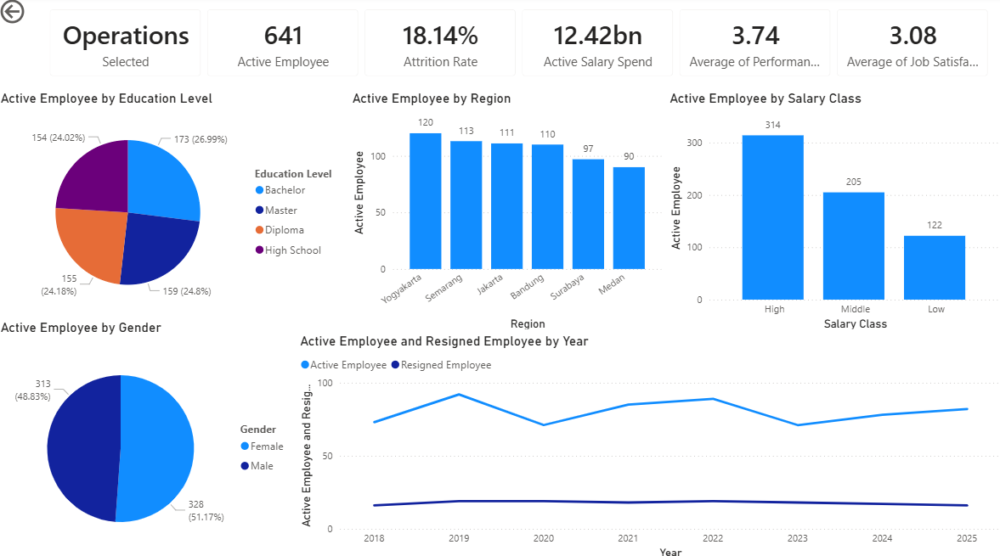
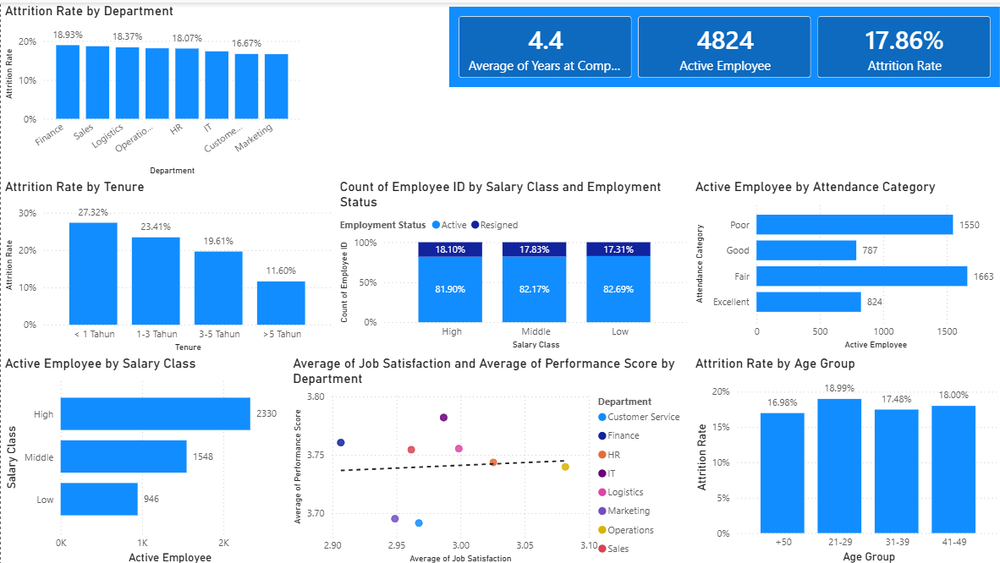

# HR-Analytic-Portofolio
Data Cleaning, SQL Analysis, Excel Dashboard, and Power BI Dashboard

## Project Overview
This project analyzes employee data to identify workforce trends, employee attrition, salary distribution, and department performance.

## Tools :
- Excel
- PostgreSQL
- Power BI

## Data Cleaning
- Removed duplicate records
- Validated future dates
- Corrected inconsistent values
- Handled missing values

## Dataset
The dataset contains 5,921 employee records and 23 columns covering demographics, employment details, compensation, attendance, and performance metrics.

## Dashboard Preview


## Pivot Preview


## Department Insight Preview


## Employee Insight Preview


## Key Insight
- Perusahaan memiliki attrition rate di 17,86%
- Perusahaan saat ini memiliki 4.824 employee aktif dan 1.049 employee yang telah resign
- Salary class High (>20 juta) merupakan kelompok terbesar dalam populasi employee aktif
- Dari Analisa, korelasi antara job satisfaction sangat lemah, cenderung tidak ada, dengan performance score (R = 0,02)
- Employee dengan masa kerja kurang dari 1 tahun memiliki attrition rate tertinggi dibanding kelompok tenure lainnya

## Repository Structure

```text
HR-Analytics-Portfolio/
│
├── Data/
│   ├── hr_data_raw.csv
│   └── hr_data_cleaned.csv
│
├── Excel/
│   └── Data HR Employee.xlsx
│
├── SQL/
│   ├── 01_data_cleaning.sql
│   ├── 02_eda.sql
│   └── 03_business_insights.sql
│
├── Power BI/
│   └── HR_Analytics_Dashboard.pbix
│
├── Images/
│   ├── before_cleaning.png
│   ├── after_cleaning.png
│   ├── pivot_analysis.png
│   └── powerbi_dashboard.png
│
└── README.md
```
